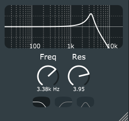

Filter
======

Filter plugin made with JUCE (v5.4.3). A screenshot of the plugin can be seen below.

	

			
## Current features
* Controllable parameters:
	- Frequency: Center frequency of the filter
	- Resonance
	- Filter type: LP, HP, BP
- FIlter design: JUCE StateVariableFilter
- Graph of magnitude response
- Resizable
